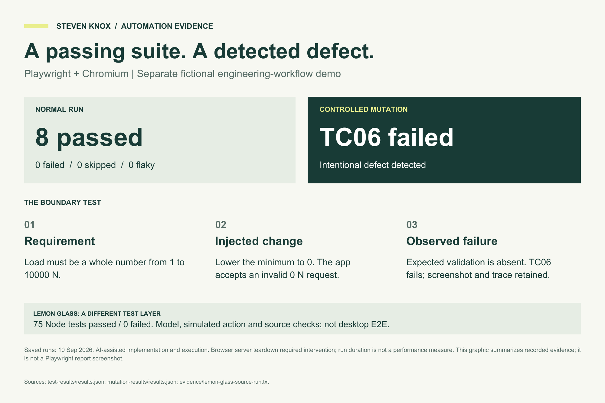

# Lemon Glass | QA Portfolio

**Steven Knox · Manual investigation · JavaScript regression · AI-assisted development**

Lemon Glass is my Windows personal finance application. This repository presents a testable source excerpt and QA case study, plus a **separate fictional Playwright demonstration**. It is not the complete Lemon Glass application or a browser demo of Lemon Glass.

[Read the two-page portfolio](media/Lemon_Glass_LinkedIn_QA_Portfolio.pdf) · [Inspect the evidence](evidence/README.md) · [Run the browser demonstration locally](playwright-demo/README.md)



## Start here

| Area | What to inspect |
| --- | --- |
| Duplicate recurring income | [Regression tests](lemon-glass-tests/test/recurring-income-duplicates.test.cjs) and [finance model](lemon-glass-tests/renderer/finance-model.js) |
| Savings and reserves | [Synchronization](lemon-glass-tests/test/savings-sync.test.cjs) and [goal deletion](lemon-glass-tests/test/savings-deletion.test.cjs) |
| Validation and recovery | [Transaction amounts](lemon-glass-tests/test/transaction-amounts.test.cjs), [Fresh Start](lemon-glass-tests/test/fresh-start.test.cjs), [backup loading](lemon-glass-tests/test/backup-load.test.cjs) |
| Browser automation | [Eight Playwright scenarios](playwright-demo/tests/workflows.spec.js), especially TC06 and TC07 |
| Controlled failure | [Defect analysis](playwright-demo/docs/DEFECT-ANALYSIS.md) and [saved screenshot](evidence/playwright-intentional-failure.png) |

## Lemon Glass: investigate the expected behavior

Recording the same recurring €500 salary twice originally created two entries without warning. Income increased from €1,700 to €2,200 and bank balance from €1,470 to €1,970. Regression checks now exercise the same-cycle guard, pending receipts, distinct recurring identities and legitimate next-cycle receipts.

A separate investigation showed correct behavior: a pending €60 expense belonged to the 6 September-5 October cycle. Clearing it changed the bank balance from €1,030 to €970 while the budget balance stayed €970. The next cycle carried €970 with no new activity. Checking both periods prevented a false defect report.

## Run the Lemon Glass regression snapshot

Use Node.js 24, then run from the repository root:

```sh
node --test lemon-glass-tests/test/*.test.cjs
```

No dependency installation is needed. **75 checks passed** when this publication copy was verified on Windows on 10 September 2026. These are model, simulated action and source-structure checks, not 75 desktop E2E tests. The supplied historical run log is retained separately.

The excerpt retains original package metadata because tests inspect it. Do not run its Electron start/build scripts: the full application and installer are not included.

## Separate Playwright demonstration

The engineering-request app uses fictional data and browser session storage. The package records eight passing Chromium tests. An intentional change from minimum load 1 to 0 causes TC06 to fail when an invalid 0 N request enters the queue. This is an injected demonstration defect, not a Lemon Glass or Synera defect.

See [setup and demo instructions](playwright-demo/README.md). There is no hosted application or production backend in this repository.

## Contribution and scope

I performed manual walkthroughs, supplied application values and observations, investigated behavior across accounts and requested focused fixes. AI substantially assisted test planning, implementation, documentation and automated execution. The recorded runs were performed by the assistant; they do not establish independent professional Playwright experience.

Prepared manual cases are not newly executed passes. The original manual build was not recorded. The rc.2 patch installation acceptance remained pending in the supplied evidence. The Playwright rerun required server-teardown intervention, so its duration is not a performance result. No hosted CI, production authentication, cross-browser or CAD integration coverage is claimed.

Source: the supplied Synera application package dated 10 September 2026. Personal-project evidence only; no affiliation with or testing of Synera software is implied. No open-source license is granted by this publication.
